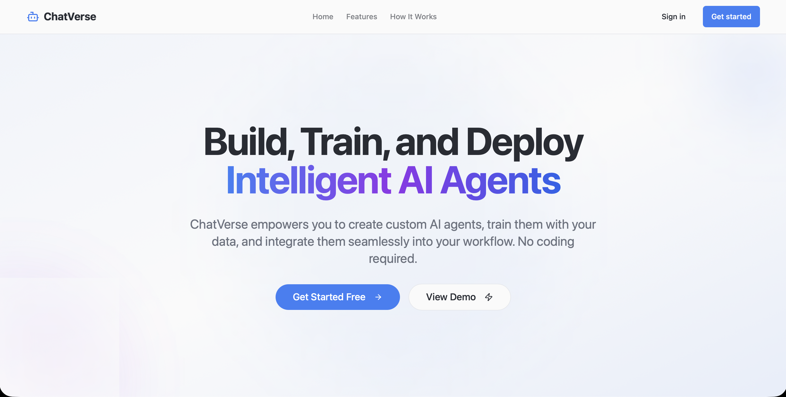
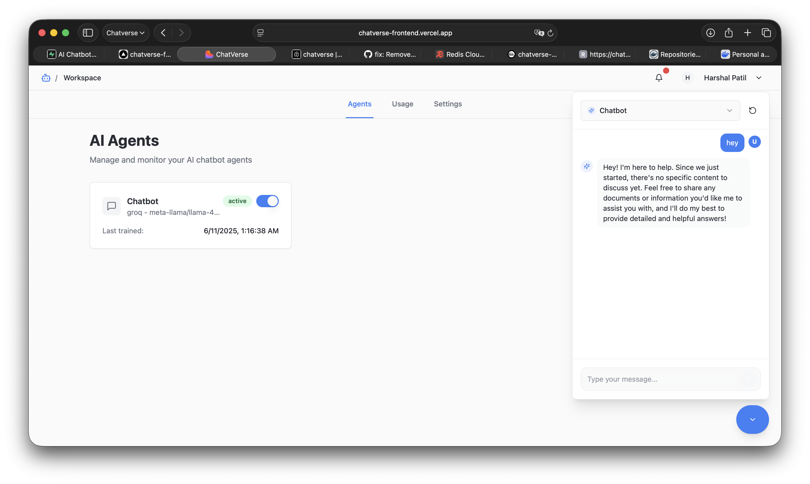
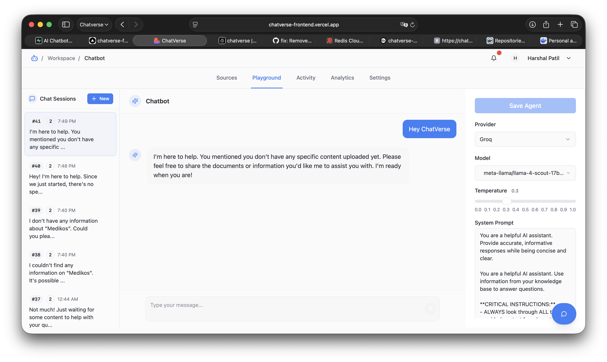
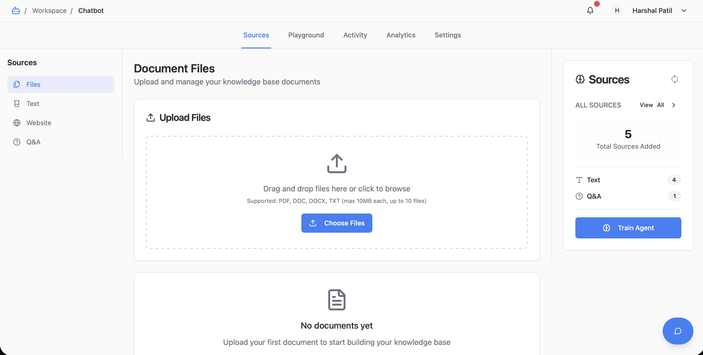

a# ChatVerse

**Build, train, and deploy intelligent AI agents with ease. No coding required.**

ChatVerse is a comprehensive platform that empowers users to create custom AI agents, train them with diverse data sources, and integrate them seamlessly into workflows. Choose from multiple AI providers, manage data sources, and deploy agents through an intuitive web interface.

## 📸 Screenshots

### Dashboard Overview


### Agent Management


### Data Sources


### Chat Playground


## ✨ Key Features

- **🤖 Multiple AI Providers**: OpenAI, Claude, Gemini, Groq - switch seamlessly
- **📊 Diverse Data Sources**: Files, text, websites, databases, Q&A pairs
- **🧠 Intelligent Training**: Advanced vector embeddings and semantic search
- **💬 Real-time Playground**: Test agents in live chat environment
- **📈 Advanced Analytics**: Performance metrics, token usage, costs
- **⚡ Lightning Fast**: Optimized with caching and efficient data fetching
- **🔒 Enterprise Security**: Bank-grade encryption and access control
- **🔌 API-First Design**: Comprehensive REST API for integrations

## 🚀 Getting Started

### Prerequisites
- Node.js (v18 or higher)
- npm or yarn

### Installation

1. **Clone the repository:**
   ```bash
   git clone <repository-url>
   cd chatverse-frontend
   ```

2. **Install dependencies:**
   ```bash
   npm install
   ```

3. **Start the development server:**
   ```bash
   npm run dev
   ```

4. **Open your browser:**
   Visit [http://localhost:8080](http://localhost:8080)

## 📦 Available Scripts

- `npm run dev` - Start development server
- `npm run build` - Build for production
- `npm run preview` - Preview production build
- `npm run lint` - Run ESLint
- `npm run type-check` - Run TypeScript type checking

## 🛠️ Tech Stack

- **Frontend**: React 18, TypeScript, Vite
- **Styling**: Tailwind CSS, Radix UI
- **State Management**: TanStack Query, React Context
- **Routing**: React Router
- **HTTP Client**: Axios
- **Build Tool**: Vite
- **Icons**: Lucide React

## 📁 Project Structure

```
src/
├── components/          # Reusable UI components
│   ├── ui/             # Base UI components (Radix UI + Tailwind)
│   ├── layout/         # Layout components (Header, Navigation)
│   ├── agents/         # Agent-specific components
│   ├── dashboard/      # Dashboard sections
│   └── homepage/       # Landing page components
├── contexts/           # React Contexts (auth, theme, agent)
├── hooks/              # Custom React hooks with TanStack Query
├── lib/                # Utilities, API client, constants
├── pages/              # Route-level pages
├── providers/          # Context composition providers
├── services/           # API service modules
├── types/              # TypeScript definitions
└── public/             # Static assets and screenshots
```

## 🔐 Authentication

- Secure sign in/sign up with JWT tokens
- Protected routes for workspace access
- Persistent login state
- Automatic token refresh

## 📤 Deployment

### Build for Production

```bash
npm run build:production
```

The built files in the `dist` directory can be deployed to:
- Vercel
- Netlify
- AWS S3 + CloudFront
- Any static hosting service

### Environment Variables

Create a `.env` file with:
```env
VITE_API_BASE_URL=https://your-api-domain.com/api/v1
VITE_APP_NAME=ChatVerse
```

## 🤝 Contributing

1. Fork the repository
2. Create a feature branch: `git checkout -b feature-name`
3. Make your changes and commit: `git commit -m 'Add feature'`
4. Push to your branch: `git push origin feature-name`
5. Submit a pull request

## 📄 License

This project is licensed under the MIT License.

---

## 🚀 Overview

ChatVerse is a feature-rich, production-ready platform for managing AI chatbots, their data sources, and workflows. It is designed for extensibility, maintainability, and a seamless developer experience.

**Key Features:**

- **Authentication**: Secure sign in/sign up, protected routes, persistent sessions
- **Chatbot Management**: Create, configure, and deploy AI chatbots
- **Data Sources**: Modular support for file, text, website, database, and Q&A sources
- **File Uploads**: Efficient, scalable file uploads using `multipart/form-data`
- **Responsive UI**: Mobile-first, accessible, and visually appealing
- **Modern Stack**: React 18, TypeScript, Vite, Tailwind CSS, TanStack Query, Radix UI

---

## 🏗️ Project Structure

```
src/
├── components/          # Reusable UI components
│   ├── ui/             # Base UI (buttons, inputs, dialogs, etc.)
│   ├── layout/         # Layout (Header, Navigation, Sidebar)
│   ├── agents/         # Agent-specific UI
│   └── dashboard/      # Dashboard sections (activity, analytics, sources, etc.)
├── contexts/           # React Contexts (auth, theme, error, loading)
├── hooks/              # Custom React hooks (data fetching, auth, etc.)
├── lib/                # Utilities, API clients, constants
│   └── api/            # Axios client, token management
├── pages/              # Route-level pages (Homepage, Dashboard, SignIn, etc.)
├── providers/          # App-wide providers (context composition)
├── services/           # API service modules
│   └── sources/        # Modular source services (file, text, website, database, qa)
├── types/              # TypeScript type definitions
└── public/             # Static assets
```

---

## ⚙️ Getting Started

### Prerequisites

- Node.js (v18 or higher)
- npm or yarn

### Installation

1. **Clone the repository:**
   ```bash
   git clone <repository-url>
   cd chatverse-frontend
   ```
2. **Install dependencies:**
   ```bash
   npm install
   # or
   yarn install
   ```
3. **Start the development server:**
   ```bash
   npm run dev
   # or
   yarn dev
   ```
4. **Open your browser:**
   Visit [http://localhost:8080](http://localhost:8080)

---

## 📦 Scripts

- `npm run dev` / `yarn dev` &mdash; Start the development server
- `npm run build` / `yarn build` &mdash; Build for production
- `npm run preview` / `yarn preview` &mdash; Preview the production build
- `npm run lint` / `yarn lint` &mdash; Run ESLint

---

## 🧩 Architecture & Best Practices

- **Modular Services:**
  - Each source type (file, text, website, database, QA) has its own service in `src/services/sources/` for maintainability and scalability.
  - File uploads use `multipart/form-data` for efficiency (see `file-upload-examples.ts`).
- **React Query (TanStack Query):**
  - All data fetching and mutations are handled via hooks in `src/hooks/`, providing caching, loading, and error states.
- **Context API:**
  - Global state (auth, agent, theme, error, loading) is managed via React Contexts in `src/contexts/` and composed in `src/providers/`.
- **Type Safety:**
  - All API contracts and data models are defined in `src/types/`.
- **UI Consistency:**
  - Base UI components in `src/components/ui/` ensure a consistent look and feel.
- **Environment Config:**
  - API endpoints and app config are managed in `src/lib/constants.ts` and `.env` variables.

---

## 🔐 Authentication

- Protected routes for workspace and agent management
- Persistent login state (localStorage)
- Automatic redirect after login
- User profile and sign out

---

## 📁 File Uploads

- **Single and Multiple File Uploads:**
  - Uses `FormData` and `multipart/form-data` for efficient uploads
  - No base64 encoding (see `src/services/sources/file.service.ts`)
  - Progress reporting supported
- **API Example:**
  - See `src/services/sources/file-upload-examples.ts` for usage

---

## 🛠️ Extending the App

- Add new source types by creating a new service in `src/services/sources/` and updating hooks/types as needed
- Add new UI features by composing base components in `src/components/ui/`
- Update API endpoints in `src/lib/constants.ts`

---

## 🚢 Deployment

### Build for Production

```bash
npm run build
# or
yarn build
```

The built files will be in the `dist` directory and can be deployed to any static hosting service.

---

## 🤝 Contributing

1. Fork the repository
2. Create a feature branch: `git checkout -b feature-name`
3. Make your changes and commit: `git commit -m 'Add some feature'`
4. Push to your branch: `git push origin feature-name`
5. Submit a pull request

---

## 📄 License

This project is licensed under the MIT License. See the LICENSE file for details.
